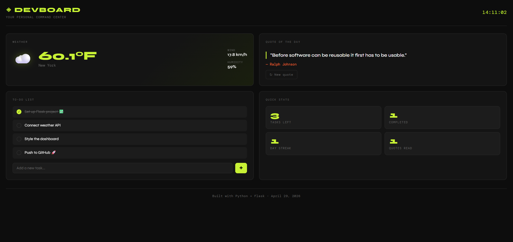

# ◈ DevBoard — Personal Developer Dashboard

A full-stack personal dashboard built with **Python (Flask)** on the backend and **HTML/CSS/JavaScript** on the frontend. Features live weather, motivational dev quotes, and a to-do list — all in a clean dark UI.



---

## Features

- 🌤️ **Live Weather** — Real-time temperature, wind speed, and humidity via Open-Meteo API (no API key needed)
- 💬 **Dev Quotes** — Rotating motivational quotes for developers
- ✅ **To-Do List** — Add, complete, and delete tasks
- 📊 **Quick Stats** — Live counters for tasks and quotes read
- 🕐 **Live Clock** — Real-time clock in the header
- 📱 **Responsive** — Works on mobile and desktop

---

## Tech Stack

| Layer    | Technology          |
|----------|---------------------|
| Backend  | Python 3, Flask     |
| Frontend | HTML5, CSS3, Vanilla JS |
| API      | Open-Meteo (free, no key) |
| Fonts    | Google Fonts (Syne + DM Mono) |

---

## Getting Started

### 1. Clone the repo
```bash
git clone https://github.com/YOUR_USERNAME/devboard.git
cd devboard
```

### 2. Install dependencies
```bash
pip install -r requirements.txt
```

### 3. Run the app
```bash
python app.py
```

### 4. Open in browser
```
http://localhost:5000
```

---

## Customization

**Change the weather city** — open `app.py` and update these three lines:
```python
CITY_NAME = "New York"
LAT = 40.7128
LON = -74.0060
```
Find your city's coordinates at [latlong.net](https://www.latlong.net).

---

## Project Structure

```
devboard/
├── app.py                  # Flask backend — API routes
├── requirements.txt        # Python dependencies
├── templates/
│   └── index.html          # Main HTML page
└── static/
    ├── css/
    │   └── style.css       # All styling
    └── js/
        └── main.js         # Frontend logic
```

---

## Deployment

Deploy for free on [Render](https://render.com):
1. Push this repo to GitHub
2. Create a new Web Service on Render
3. Set build command: `pip install -r requirements.txt`
4. Set start command: `gunicorn app:app`
5. Done — your dashboard is live 🚀

---

## License

MIT — free to use and modify.
